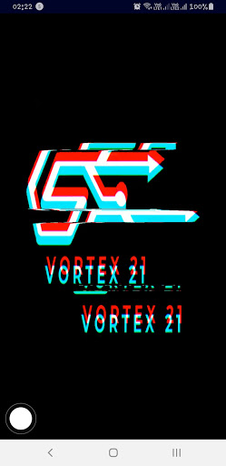
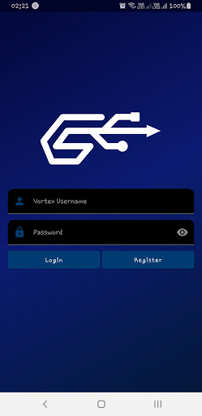
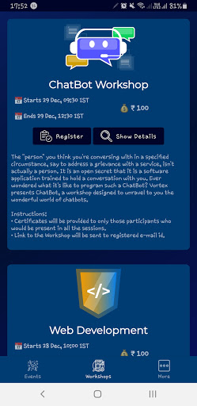

# Vortex 21

> Annual national level technological symposium of CSE department NITT

<a href="https://vortex.nitt.edu"></a>
<a href='https://play.google.com/store/apps/details?id=edu.nitt.vortex2021&pcampaignid=pcampaignidMKT-Other-global-all-co-prtnr-py-PartBadge-Mar2515-1'></a>


## About

Vortex is a platform for technocrats to showcase their prowess in the field of
Computer Science. Organised by the Computer Science and Engineering Association
of [NIT Trichy](https://nitt.edu), this annual technological symposium attracts
students from across the country. This application has been developed with the
goal of reaching people to enable their participation in workshops, events and
guest lectures even through the difficult circumstances that surround us. Install
now to stay updated with the latest news from Vortex!

## Developer's Guide

### Pre requisites
- Android Studio 3.0 or higher
- Support for Android [API level 21](https://developer.android.com/studio/releases/platforms#5.0) or higher
- Support for Java 8

### Setup Guide
- 👾 Clone this repository
```bash
git clone --depth 1 https://github.com/csea-vortex/android-vortex-21
```
- 🔥 Create [firebase project](https://firebase.google.com/docs/android/setup#console) and save the [`google-services.json`](https://support.google.com/firebase/answer/7015592?hl=en) in `app/google-services.json`

- 📂 Open the project in [Android Studio](https://developer.android.com/studio/)
- 🔨 Build and [Run your app](https://developer.android.com/training/basics/firstapp/running-app)

## Screenshots




